## 义码当仙之Redis

### 一、特性
#### 1.速度快：10w QOS（每秒10万次读写）
#### 2.支持持久化：RDB、AOF
#### 3.多种数据结构
- BitMaps：位图
- HyperLogLog：超小内存唯一值计数
- GEO：地理位置信息定位
- string：字符串类型
- hash：哈希类型
- list：列表类型
- set：集合类型
- zset：有序集合类型

#### 4.支持多种客户端语言
#### 5.功能丰富
- 发布订阅
- 事务
- Lua脚本
- pipeline

#### 6.简单
- 单机核心代码约23000 lines
- 不依赖外部库
- 单线程模型

#### 7.支持主从复制

#### 8.支持高可用、分布式
- Redis-Sentinel(v2.8)支持高可用
- Redis-Cluster(v3.0)支持分布式

### 二、应用场景
- 缓存系统
- 计数器
- 消息队列系统
- 排行榜
- 社交网络
- 实时系统

### 三、Redis安装
#### 1.总体步骤
```bash
wget http://download.redis.io/release/redis-3.2.13.tar.gz
ln -s redis-3.2.13 redis
cd redis
make && make install
```
#### 2.可执行文件说明
- redis-server：Redis服务器
- redis-cli：Redis命令行客户端
- redis-benchmark：Redis性能测试工具
- redis-check-aof：AOF文件修复工具
- redis-check-dump：RDB文件修复工具
- redis-sentinel：Sentinel服务器(v2.8以后)

#### 3.三种启动方法
- 最简启动
```bash
redis-server
验证：
ps -ef | grep redis
netstat -antpl | grep redis
```
- 动态参数启动
```bash
redis-server --port 6379
```
- 配置文件启动（推荐）
```bash
redis-server configPath
```
#### 4.客户端连接
```bash
redis-cli -h 172.16.49.131 -p 6379
验证：ping ，redis返回pong
```
#### 5.redis常用配置
- daemonize：是否是守护进程（no | yes）
- port：Redis对外端口号，默认端口6379
- logfile：Redis系统日志
- dir：Redis工作目录
...

#### 6.具体安装步骤
```bash
mkdir -p /opt/download
mkdir -p /opt/app
cd /opt/download
wget http://download.redis.io/release/redis-3.2.13.tar.gz
tar -xvf redis-3.2.13.tar.gz -C /opt/app
cd /opt/app
为了方便目录管理和未来的升级，建立软链接
ln -s redis-3.2.13/ redis
cd redis
make
make install

查看可执行文件
cd src
ll | grep redis-

（1）最简启动服务：
redis-server

开发6379端口，支持外部客户端访问：
firewall-cmd --permanent --zone=public --add-port=6379/tcp
firewall-cmd --reload
firewall-cmd --list-ports 

客户端连接：
redis-cli -h 127.0.0.1 -p 6379，默认配置可直接使用redis-cli

（2）动态参数启动服务及客户端连接：
redis-server --port 6380
redis-cli -p 6380

（3）配置文件方式启动（推荐）：
cd /opt/app/redis
mkdir config
cp redis.conf config/
cd config/

将redis.conf内容去掉注释和空格后重定向写入到redis-6381.conf中：
cat redis.conf | grep -v "#" | grep -v "^$" > redis-6381.conf
vim redis-6381.conf，更改默认参数设置：
daemonize no -> daemonize yes (以守护进程方式启动)
port 6379 -> port 6381 （端口号）
dir /opt/app/redis/data/ (工作目录)
logfile "6381.log" （日志文件）

cd ..
mkdir data
redis-server config/redis-6381.conf
查看是否启动：ps -ef | grep redis-server | grep 6381
查看日志文件：cat data/6381.log

客户端连接：
redis-cli -h 127.0.0.1 -p 6381
```
### 三、Redis API的使用和理解
#### 1.通用命令
- 通用API

keys：一般不在生产环境使用，用热备从节点scan命令实现 O(n)  
keys * 遍历出所有key；  
keys [pattern]  

dbsize：计算key的总数 O(1)  

exists key：检查key是否存在 O(1)  

del key [key...]：删除指定key-value O(1)  

expire key seconds：key在seconds秒后过期 O(1)  
ttl key：查看key剩余的过期时间。若返回-1代表key存在，并且没有过期时间；若返回-2代表key已经过期被删除  
persist key：去掉key的过期时间  

type key：返回key的类型（string,hash,list,set,zset,none）O(1)  

- 数据结构和内部编码

string：raw；int；embstr  
hash：hashtable；ziplist  
list：linkedlist；ziplist  
set：hashtable；intset  
zset：skiplist；ziplist  

- 单线程架构

存内存  
非阻塞IO  
避免线程切换和竞态消耗  

一次之运行条命令
拒绝长（慢）命令：keys,flushall,slow lua script,multi/exec,operate big value(collection)  
其实不是单线程：fysnc file descriptor；close file descriptor  

#### 2.字符串类型  

value大小上限：512MB  
应用场景：缓存；计数器；分布式锁  
- 常用API  
（1）get key：获取key对应的value，时间复杂度O(1)  
（2）set key value：设置key-value，时间复杂度O(1)  
（3）del key：删除key-value，时间复杂度O(1)  
（4）incr key：自增1，如果key不存在，自增后get(key)=1，时间复杂度O(1)  
（5）decr key：自减1，如果key不存在，自减后get(key)=-1，时间复杂度O(1)  
（6）incrby key k：自增k，如果key不存在，自增后get(key)=k，时间复杂度O(1)  
（7）decrby key k：自减k，如果key不存在，自减后get(key)=-k，时间复杂度O(1)  
（8）set key value：不管key是否存在，都设置，时间复杂度O(1)  
（9）setnx key value：key不存在，才设置，时间复杂度O(1)  
（10）set key value xx：key存在，才设置，时间复杂度O(1)  
（11）set key value ex seconds：set与expire组合命令，原子操作，时间复杂度为O(1)  
（12）mget key1 key2 key3...：批量获取key，原子操作，时间复杂度O(n)  
相当于执行n次get的返回结果，n次get时间 = n次网络时间 + n次命令时间，而1次mget时间 = 1次网络时间 + n次命令时间  
（13）mset key1 value1 key2 value2 key3 value3...：批量设置key-value，时间复杂度O(n)  
（14）getset key newvalue：set key newvalue并返回旧的value，时间复杂度O(1)  
（15）append key value：将value追加到旧的value，时间复杂度O(1)  
（16）strlen key：返回value字符串的长度（注意中文），时间复杂度O(1)  
（17）incrbyfloat key 3.5：增加key对应的值3.5，时间复杂度O(1)  
（18）getrange key start end：获取字符串指定下标所有的值，时间复杂度O(1)  
（19）setrange key index value：设置指定下标所有对应的值，时间复杂度O(1)  

- 实战

（1）记录网站每个用户的个人主页的访问量？  
incr userid:pageview（单线程，无竞争）  
（2）缓存视频的基本信息（数据源再MySQL中）伪代码  
```java
public VideoInfo get(long id){
   String redisKey = redisPrefix + id;
   VideoInfo videoInfo = redis.get(redisKey);
   if(videoInfo == null){
      videoInfo = mysql.get(id);
      if(videoInfo != null){
         //序列化
         redis.set(reidsKey, serialize(videoInfo));
      }
   }
}
```
（3）分布式id生成器  
incr id（原子操作）  

#### 3.哈希类型

- 特点
（1）key field value  
（2）Mapmap  
（3）small redis  

- 常用API  
（1）hget key field：获取hash key对应的field的value，时间复杂度O(1)  
（2）hset key field value：设置hash key对应field的value，时间复杂度O(1)  
（3）hdel key field：删除hash key对应field的value，时间复杂度O(1)  
（4）hexists key field：判断hash key是否有field，时间复杂度O(1)  
（5）hlen key：获取hash key field的数量，时间复杂度O(1)  
（6）hmget key field1 field2 ... fieldN：批量获取hash key的一批field对应的值，时间复杂度O(n)  
（7）hmset key field1 value1 field2 value2 ... fieldN valueN：批量设置hash key的一批field value，时间复杂度O(n)  
（8）hgetall key：返回hash key对应所有的field和value，时间复杂度O(n)  
（9）hvals key：返回hash key对应所有field的value，时间复杂度O(n)  
（10）hkeys key：返回hash key对应所有field，时间复杂度O(n)  
（11）hsetnx key field value：设置hash key对应field的value（如field已经存在，则失败），时间复杂度O(1)  
（12）hincrby key field intCounter：hash key对应的field的value自增intCounter  
（13）hincrby key field floatCounter：hincrby浮点数版  

- 实战  

（1）记录网站每个用户的个人主页的访问量？  
hincrby user:1:info pageview count  
（2）缓存视频的基本信息（数据源再MySQL中）伪代码  
```java
public VideoInfo get(long id){
   String redisKey = redisPrefix + id;
   Map<String,String> hashMap = redis.hgetAll(redisKey);
   VideoInfo videoInfo = transferMapToVideo(hashMap);
   if(videoInfo == null){
      videoInfo = mysql.get(id);
      if(videoInfo != null){
         //序列化
         redis.hmset(reidsKey, transferVideoToMap(videoInfo));
      }
   }
}
```
（3）用户信息缓存  
用户信息（string实现）  

|key|value(serializable:json,xml,protobuf)|
|:----|:----|
|user:1|{"id":1,"name":"ymdx","age":30,"pageView":50000}|

set user:1 serialize(userinfo)

用户信息（string实现-v2）  

|key|value|
|:----|:----|
|user:1:name|ymdx|
|user:1:age|30|
|user:1:pageView|50000|

set user:1:age 31

用户信息（hash）  

|key|field|value|
|:----|:----|:----|
|user:1:info|name<br>age<br>pageView|ymdx<br>30<br>50000|

hset user:1:info age 31

三种方案比较

|命令|优点|缺点|
|:----|:----|:----|
|string v1|编程简单；可能节约内存|序列化开销；设置属性要操作整个数据|
|string v2|直观；可以部分更新|内存占用较大；key较为分散|
|hash     |直观；节省空间；可以部分更新|编程稍微复杂；ttl不好控制|

- hash vs string

|string|hash|
|:----|:----|
|get|hget|
|set setnx|hset hsetnx|
|del|hdel|
|incr incrby decr decrby|hincrby
|mset|hmdet|
|mget|hmget|

#### 4.列表类型
- 数据结构：有序队列  
- 特点：有序，可以重复，左右两边插入弹出  
可以对元素执行：lpush,lpop,rpush,rpop,llen,lrem,lrange,lindex等命令  

- 常用API  
（1）rpush key value1 value2 ... valueN：从列表右端插入值（1~N个），时间复杂度O(1~n)  
（2）lpush key value1 value2 ... valueN：从列表左端插入值（1~N个），时间复杂度O(1~n)  
（3）linsert key before|after value newValue：在list指定的值前|后插入newValue，时间复杂度O(n)  
（4）lpop key：从列表左侧弹出一个item，时间复杂度O(n)  
（5）rpop key：从列表右侧弹出一个item，时间复杂度O(n)  
（6）lrem key count value：根据count值，从列表中删除所有value相等的项，时间复杂度O(n)  
count > 0，从左到右，删除最多count个value相等的项；  
count < 0，从右到左，删除最多Masth.abs(count)个value相等的项；  
count = 0，删除所有value相等的项  
（7）ltrim key start end：按照索引范围修剪列表，时间复杂度O(n)  
（8）lrange key start end（包含end）：获取列表指定索引范围所有item，时间复杂度O(n)  
索引：以6个元素为例，从左到右0～5；从右到左-1～-6  
（9）lindex key index：获取列表指定索引的item，时间复杂度O(n)  
（10）len key：获取列表长度，时间复杂度O(1)  
（11）lset key index newValue：设置列表指定索引值为newValue  
（12）blpop key timeout：lpop阻塞版本，timeout是阻塞超时时间，timeout=0为永远不阻塞，时间复杂度O(1)  
（13）brpop key timeout：rpop阻塞版本，timeout是阻塞超时时间，timeout=0为永远不阻塞，时间复杂度O(1)  

- 实战  
微博-TimeLine  

- 口诀  
LPUSH + LPOP = Stack  
LPUSH + RPOP = Queue  
LPUSH + LTRIM = Capped Collection  
LPUSH + BRPOP = Message Queue  

#### 5.集合类型  
- 数据结构：key-value  
- 特点：无序，不能重复，支持集合间的操作  
可以对元素执行：sadd,sinter,sdiff,sunion等命令  

- 常用API  
（1）sadd key element：向集合key添加element（如果element已经存在，添加失败），时间复杂度O(1)  
（2）srem key element：将集合key中的element移除掉，时间复杂度O(1)  
（3）scard key：计算集合大小，时间复杂度O(1)  
（4）sismember key element：判断element是否在集合中，时间复杂度O(1)  
（5）srandmember key count：从集合中随机挑选count个元素，时间复杂度O(1)  
（6）spop key：从集合中随机挑选一个元素，时间复杂度O(1)  
（6）smembers key：获取集合中所有元素，时间复杂度O(n)  
（7）sdiff key1 key2：差集  
（8）sinter key1 key2：交集  
（9）sunion key1 key2：并集  
（10）sdiff|sinter|sunion + store destKey：将差集或交集或并集结果保存再destKey中  

- 实战  

（1）抽奖系统：spop  
（2）Like、赞、踩  
（3）标签（tag）  
（4）共同关注：sinter  

- 口诀  
SADD = Tagging  
SPOP/SRANDMEMBER = Random item  
SADD + SINTER = Social Graph  

#### 6.有序集合类型  
- 数据结构：key-score-value  
- 特点：有序，不能重复  
- 常用API  
（1）zadd key score element（可以是多对）：添加score和element，时间复杂度为O(logN)  
（2）zrem key element（可以是多个）：删除元素，时间复杂度O(1)  
（3）zscore key element：返回元素的分数，时间复杂度O(1)  
（4）zincrby key increScore element：增加或减少元素的分数，时间复杂度O(1)  
（5）zcard key：返回元素的总个数，时间复杂度O(1)  
（6）zrank key element：获取元素的排名（排名从0开始计算），时间复杂度O(1)  
（7）zrange key start end [withscores]：返回指定索引范围内的升序元素[分数]，时间复杂度O(log(n)+m)  
（8）zrangebyscore key minScore maxScore [withsocres]：返回指定分数范围内的升序元素[分值]，时间复杂度O(log(n)+m)  
（9）zcount key minScore maxScore：返回有序集合内在指定分数范围内的个数，时间复杂度O(log(n)+m)  
（10）zremrangebyrank key start end：删除指定排名内的升序元素，时间复杂度O(log(n)+m)  
（11）zremrangebyscore key minScore maxScore：删除指定分数内的升序元素，时间复杂度O(log(n)+m)  
（12）zrevrank  
（13）zrevrange  
（14）zrevrangebyscore  
（15）zinterstore  
（16）zunionstore  

|操作类型|命令|
|:----|:----|
|基本操作|zadd zrem zcard zincrby zscore|
|范围操作|zrange zrangebyscore zcount zremrangebyrank|
|集合操作|zunionstore zinterstore|

- 实战  
（1）排行榜 score:timeStamp saleCount followCount  

### 三、Redis 客户端  
#### 1.Java客户端：Jedis  
- Jedis直连  
- Jedis连接池  

||优点|缺点|
|:----|:----|:----|
|直连|简单方便；<br>适用于少量长期连接的场景|存在每次新建/关闭TCP开销；<br>资源无法控制，存在连接泄漏的可能；<br>Jedis对象线程不安全|
|连接池|Jedis预先生成，降低开销使用；<br>连接池的形式保护和控制资源的使用|相对于直连，使用相对麻烦，尤其在资源的管理上需要很多参数来保证，<br>一旦规划不合理也会出现问题|

### 四、Redis扩展功能  
#### 1.慢查询  
- 生命周期：发送命令 -> 排队 -> 执行命令 -> 返回结果  
- 两个配置：  

slowlog-max-len  
先进先出队列；固定长度；保存在内存中  

slowlog-log-slower-than  
慢查询阈值（单位：微秒）  
slowlog-log-slower-than = 0，记录所有命令  
slowlog-log-slower-than < 0，不记录任何命令  

配置方法：  
（1）默认值：  
config get slowlog-max-len = 128  
config get slowlog-log-slower-than = 10000  
（2）修改配置文件重启  
（3）动态配置  
config set slowlog-max-len 1000  
config set slowlog-log-slower-than 1000  

- 慢查询API  
（1）slowlog get [n]：获取慢查询队列  
（2）slowlog len：获取慢查询队列长度  
（3）slowlog reset：清空慢查询队列  

- 运维经验  
（1）slowlog-max-len不要设置过大，默认10ms，通常设置1ms  
（2）slowlog-log-slower-than不要设置过小，通常设置1000左右  
（3）理解命令生命周期  
（4）定期持久化慢查询  

#### 2.pipeline  
- 作用  

|命令|N个命令操作|1次pipeline（n个命令）|
|:----|:----|:----|
|时间|n次网络 + n次命令|1次网络 + n次命令|
|数据量|1条命令|n条命令|
注意：  
（1）redis的命令时间是微妙级别；  
（2）pipeline每次条数要控制（网络）  

- 使用建议  
（1）注意每次pipeline携带数量；  
（2）pipeline每次只能作用在一个Redis节点上；  
（3）M操作与pipeline区别  

#### 2.发布订阅  
- 角色  
（1）发布者（publisher）  
（2）订阅者（subscriber）  
（3）频道（channel）  

- 模型  
类似于生产者与消费者模型，订阅者无法获取发布者发布的历史消息  

- API  
（1）publish channel message：订阅指定频道的消息，并返回订阅者个数  
（2）subscribe [channel...]：订阅一个多个频道  
（3）unsubscribe [channel...]：取消一个或多个频道  
（4）psubscribe [pattern...]：按模式订阅  
（5）punsubscribe [pattern...]：按模式退订  
（6）pubsub channels：列出至少有一个订阅者的频道  
（7）pubsub numsub [channel...]：列出指定频道的的订阅者数量  
（8）pubsub numpat：列出被订阅模式的数量  

- 发布订阅与消息队列  

发布订阅：发布者发布消息后，所有订阅者都能收到消息；  
消息队列：生产者生产消息后，只有一个消费者能够抢到此消息进行消费  

#### 2.Bitmap（位图）  

- API  
（1）setbit key offset value：给位图指定索引设置值  
（2）getbit key offset：获取位图指定索引的值  
（3）bigcount key [start] [end]：获取位图指定范围（start到end，单位为字节，如果不指定就是获取全部）位值为1的个数  
（4）bitop op destKey key[key...]：做多个bitmap的and（交集）、or（并集）、not（非）、xor（异或）操作病将结果保存再destKey中  
（5）bitpos key targetBit [start] [end]：获取位图指定范围（start到end，单位为字节，如果不指定就是获取全部）第一个偏移量对应的值等于targetBit的位置  

- 应用场景：独立用户统计，节省空间  

- 使用经验  
（1）type = string，最大512M  
（2）注意setbit时偏移量，可能有较大损耗  
（3）位图不是绝对的好  

#### 3.HyperLogLog  

- 数据结构  
（1）基于HyperLogLog算法：极小空间完成独立数量统计；  
（2）本质还是字符串string  

- API  
（1）pfadd key element[element...]：向hyperloglog添加元素  
（2）pfcount key[key...]：计算hyperloglog的独立总数  
（3）pfmerge destKey sourceKey[sourceKey...]：合并多个hyperloglog  

- 内存消耗少  
- 使用经验  
（1）是否能容忍错误（错误率：0.81%）  
（2）是否需要单条数据？  

#### 4.GEO  
- 是什么  
GEO（低劣信息定位）：存储经纬度，计算两地距离，范围计算等  

- API  
（1）geoadd key longitude latitude member：增加地理位置信息（经度 纬度 标识）  
（2）geopos key member[members...]：获取地理位置信息  
（3）geodist key member1 member2 [unit]：获取两个地理位置的距离，单位[unit]：m（米）、km（千米）、mi（英里）、ft（尺）  
（4）georadius key longitude latitude radiusm|km|ft|mi [withcoord] [withdist] [withhash] [COUNT count] [asc|desc] [store key] [storedist key]  
georadiusbymember key member radiusm|km|ft|mi [withcoord] [withdist] [withhash] [COUNT count] [asc|desc] [store key] [storedist key]  
withcoord：返回结果中包含经纬度；  
withdist：返回结果中包含距离中心节点位置；  
withhash：返回结果中包含geohash;  
COUNT count：指定返回结果的数量  
asc|desc：返回结果按照距离中心节点的距离做升序或者降序；  
store key：将返回结果的地理位置信息保存到指定键；  
storedist key：将返回结果距离中心节点的距离保存到指定键  

- 说明  
（1）since 3.2+  
（2）type geoKey = zset  
（3）没有删除API：zrem key member  

### 五、Redis持久化的取舍和选择  
#### 1.持久化的作用  
- 什么是持久化  
redis所有数据保存在内存中，对数据的更新将一步地保存到磁盘上。  

- 持久化的实现方式  
（1）快照：MySql Dump；Redis RDB  
（2）写日志：MySQL Binlog；Hbase HLog；Redis AOF  

#### 2.RDB  
- 什么是RDB  
（1）redis（内存）--创建--> RDB文件（二进制）（硬盘）  
（2）redis（内存）<--启动重载-- RDB（二进制）（硬盘）  
（3）复制媒介  

- 触发方式-主要三种方式  
（1）save（同步）:阻塞  
文件策略：如存在老的RDB文件，新替换老  
复杂度：O(N)  
（2）bgsave（异步）  
文件策略：先生成临时文件，如存在老的RDB文件，则新的会替换老的  
复杂度：O(N)  

|命令|save|bgsave| 
|:----|:----|:----|
|IO类型|同步|异步|
|阻塞？|是|是（阻塞发生在fork）|
|复杂度|O(n)|O(n)|
|优点|不会消耗额外内存|不阻塞客户端命令|
|缺点|阻塞客户端命令|需要fork，消耗内存|

（3）自动

|配置|seconds|changes|
|:----|:----|:----|
|save|900|1|
|save|300|10|
|save|60|10000|

rdb相关默认配置：
``` config
save 900 1
save 300 10
save 60 10000
dbfilename dump.rdb
dir ./
stop-writes-on-bgsave-error yes
rdbcompression yes
rdbchecksum yes
```

最佳配置：
```
# save 900 1
# save 300 10
# save 60 10000
dbfilename dump-${port}.rdb
dir /bigdiskpath
stop-writes-on-bgsave-error yes
rdbcompression yes
rdbchecksum yes
```

- 触发方式-不容忽视方式  
（1）全量复制  
（2）debug reload  
（3）shutdown  

- 总结  
（1）RDB是Redis内存到硬盘的快照，用于持久化；  
（2）save通常会阻塞Redis；  
（3）bgsave不会阻塞Redis，但是会fork新进程；  
（4）save自动配置满足任意一个就会被执行；  
（5）有些触发机制不容忽视  


#### 3.AOF  
- RDB现存问题  
（1）耗时、耗性能： O(n)数据：耗时；fork()：消耗内存，copy-on-write策略；Disk I/O：IO性能  
（2）不可控、丢失数据  

|时间戳|save|
|:----|:----|
|T1|执行多个写命令|
|T2|满足RDB自动创建的条件|
|T3|再次执行多个写命令|
|T4|宕机，丢失数据|

- 什么是AOP  
（1）redis（内存）--写入--> 缓冲区 --同步--> AOF文件（命令日志）（硬盘）  
（2）redis（内存）<--恢复-- AOF文件（命令日志）（硬盘）  

- AOF三种策略  
（1）always：每条命令fsync到硬盘（AOF文件）  
（2）everysec：每秒把缓冲区fsync到硬盘（AOF文件）【推荐】  
（3）no：由操作系统决定把缓冲区fsync到硬盘（AOF文件）  

|命令|always|everysec|no|
|:----|:----|:----|:----|
|优点|不丢失数据|每秒一次fsync，丢1秒数据|不用管|
|缺点|IO开销较大，一般的sata盘直邮几百TPS|丢1秒数据|不可控|

- AOF重写：把过期的、无效的、重复的、可以优化的命令进行化简  
（1）减少硬盘占用量  
（2）加速恢复速度  
（3）实现方式：bgrewriteaof命令；AOF重写配置  

|命令|含义|
|:----|:----|
|auto-aof-rewrite-min-size|AOF文件重写需要的尺寸|
|auto-aof-rewrite-percentage|AOF文件增长率|

|统计名|含义|
|:----|:----|
|aof_current_size|AOF当前尺寸（单位：字节）|
|aof_base_size|AOF上次启动和重写的尺寸（单位：字节）|

自动触发时机（需同时满足）：  
aof_current_size > auto-aof-rewrite-min-size；  
(aof_current_size - aof_base_size ／ aof_base_size) > auto-aof-rewrite-percentage  

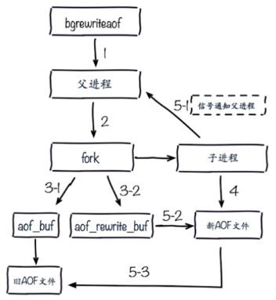

aof配置：  
appendonly yes  
appendfilename "appendonly-${port}.aof"  
appendfsync everysec  
dir /bigdiskpath  
no-appendfsync-on-rewrite yes  
auto-aof-rewrite-min-size 64mb  
auto-aof-rewrite-percentage 100  
aof-load-truncated yes  

#### 4.RDB和AOP的抉择  
- RDB和AOF比较  

|命令|RDB|AOF|
|:----|:----|:----|
|启动优先级|低|高|
|体积|小|大|
|恢复速度|快|慢|
|数据安全|丢数据|根据策略决定|
|轻重|重|轻|

- RDB最佳策略  
（1）建议“关”；  
（2）集中管理；  
（3）主从，从开？  

- AOF最佳策略  
（1）建议“开”：  
（2）缓存和存储；  
（3）AOF重写集中管理  
（4）everysec  

- 最佳策略  
（1）小分片：max memory设定  
（2）根据缓存或者存储  
（3）监控（硬盘、内存、负载、网络）  
（4）足够的内存  

### 六、Redis常见的持久化的开发运维问题  
#### 1.fork操作  
（1）同步操作  
（2）与内存量息息相关：内存越大，耗时越长（与机器类型有关）  
（3）info stats：latest_fork_usec，单位微秒  
改善：  
（1）优先使用物理机或者高效支持fork操作的虚拟化技术  
（2）控制Redis实例最大可用内存：maxmemory  
（3）合理配置Linux内存分配策略：vm.overcommit_memory = 1  
（4）降低fork频率：例如放宽AOF重写自动触发时机，不要全量复制  

#### 2.子进程的开销和优化  
（1）CPU  
开销：RDB和AOF文件生成，属于CPU密集型  
优化：不做CPU绑定，不和CPU密集型部署  
（2）内存  
开销：fork内存开销，copy-on-write  
优化：echo never > /sys/kernel/mm/transparent_hugepage/enabled  
（3）硬盘  
开销：AOF和RDB文件写入，可以结合iostat，iotop分析  
优化：不要和高硬盘负载服务部署在一起：存储服务、消息队列等；no-appendfsync-on-rewrite = yes；根据写入量决定磁盘类型：例如ssd；单机多实例持久化文件目录可以考虑分盘  

#### 3.AOF追加阻塞  
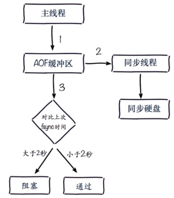  

- AOF阻塞定位  
（1）通过Redis日志  
Asynchronous AOF fsync is taking too long (disk is busy?).
Writing the AOF buffer without waiting for fsync to complete,
this may slow down Redis  
（2）通过Redis命令：info persistence  
aof_delayed_fsync: 100  
（3）通过linux 命令  
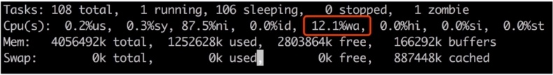

### 七、Redis复制的原理与优化  
#### 1.什么是主从复制（master-slave）  
- 单机问题  
（1）机器故障  
（2）容量瓶颈  
（3）QPS瓶颈  
- 作用：  
（1）数据副本；  
（2）扩展读性能  
- 总结：  
（1）一个master可以有多个slave；  
（2）一个slave只能有一个master；  
（3）数据流向是单向的，master到slave  

#### 2.复制的配置  
- 实现方式  
（1）slaveof命令  
eg：redis-6380> slaveof 127.0.0.1 6379  
取消复制命令：slaveof no one（此命令不会清除此前从master复制过来的数据）  
（2）配置  
slaveof ip port  
slave-read-only yes  
（3）比较  

|方式|命令|配置|
|:----|:----|:----|
|优点|无需重启|统一配置|
|缺点|不便于管理|需要重启|

#### 3.全量复制
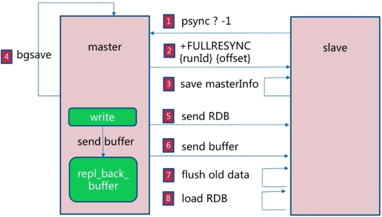  
- 开销  
（1）bgssave时间  
（2）RDB文件网络传输时间  
（3）从节点清空数据时间  
（4）从节点加载RDB时间  
（5）可能的AOF重写时间  

#### 4.部分复制  
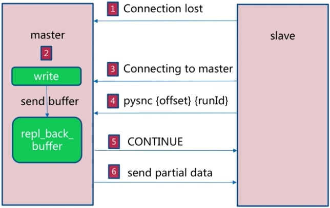  

#### 5.故障处理  
- slave宕机  
- master宕机  

#### 6.开发运维常见问题  
- 读写分离  
（1）读流量分摊到从节点  
（2）可能遇到的问题：复制数据延迟；读到过期数据；从节点故障  

- 主从配置不一致  
（1）例如maxmemory不一致：丢失数据  
（2）例如数据结构优化参数（例如hash-max-ziplist-entries）：内存不一致  

- 规避全量复制  
（1）第一次全量复制：问题 - 第一次不可避免；解决 - 小主节点、低峰时  
（2）节点运行ID不匹配：问题 - 主节点重启（运行ID变化）；解决 - 故障转移，例如哨兵或集群  
（3）复制积压缓冲区不足：问题 - 网络中断，部分复制无法满足；解决 - 增大复制缓冲区配置repl_backlog_size，网络“增强”  

- 规避复制风暴  
（1）单主节点复制风暴：问题 - 主节点重启，多从节点复制；解决 - 更换复制拓扑  
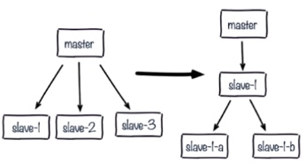  
（2）单机器复制风暴：机器宕机后，大量全量复制；主节点分散多机器  
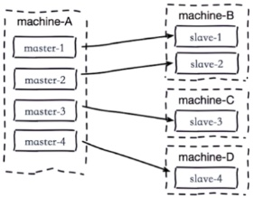  

### 八、Redis Sentinel  
#### 1.主从复制高可用  
- 问题  
（1）手动故障转移  
（2）写能力和存储能力受限  

#### 2.架构说明  
- 哨兵模式，客户端从sentinel获取redis信息  
- 故障转移过程  
（1）多个sentinel发丝安并确认master有问题；  
（2）选举出一个sentinel作为领导；  
（3）选出一个slave作为master；  
（4）通知其余slave成为新的master的slave；  
（5）通知客户端主从变化；  
（6）等待老的master复活成为新master的slave  
- 可以监控多套master-slave，用master-name作为标识区分  

#### 3.安装配置  
（1）配置开启主从节点  
（2）配置开启sentinel监控主节点（sentinel是特殊的redis）  
（3）实际应该多机器  
master-7000；slave-7001；slave-7002  
sentinel-26379；sentinel-26380；sentinel-26381  

- Redis主节点  
（1）启动：redis-server redis-7000.conf  
（2）配置：  
```
port 7000
daemonize yes
pidfile /var/run/redis-7000.pid
dir /opt/app/redis/data/
logfile "7000.log"
dbfilename dump-7000.rdb
```
- Redis从节点  
（1）启动：redis-server redis-7001.conf|redis-7002.conf  
（2）配置：  
```
port 7002/7002
daemonize yes
pidfile /var/run/redis-7001|7002.pid
dir /opt/app/redis/data/
logfile "7001|7002.log"
dbfilename dump-7001|7002.rdb
slaveof 172.16.49.131 7000
```
- sentinel主要配置  
```
port ${port}
daemonize yes
pidfile /var/run/redis-${port}.pid
dir /opt/app/redis/data/
logfile "${port}.log"
sentinel monitor mymaster 172.16.49.131 7000 2
sentinel down-after-milliseconds mymaster 30000
sentinel parallel-syncs mymaster 1
sentinel failover-timeout mymaster 180000
```
- 试验  
```
cd /opt/app/redis/config
vim redis-7000.conf
添加配置：
bind 0.0.0.0
port 7000
daemonize yes
pidfile /var/run/redis-7000.pid
dir /opt/app/redis/data/
logfile "7000.log"
dbfilename dump-7000.rdb

sed "s/7000/7001/g" redis-7000.conf > redis-7001.conf
sed "s/7000/7002/g" redis-7000.conf > redis-7002.conf
echo "slaveof 172.16.49.131 7000" >> redis-7001.conf
echo "slaveof 172.16.49.131 7000" >> redis-7002.conf

redis-server redis-7000.conf
redis-server redis-7001.conf
redis-server redis-7002.conf

ps -ef | grep redis-server | grep 700
redis-cli -h 172.16.49.131 -p 7000 info replication

cp /opt/app/redis/sentinel.conf /opt/app/redis/config
cat sentinel.conf | grep -v "#" | grep -v "^$" > redis-sentinel-26379.conf
vim redis-sentinel-26379.conf
修改配置文件：
bind 0.0.0.0
port 26379
daemonize yes
dir /opt/app/redis/data/
logfile "26379.log"
pidfile /var/run/redis-26379.pid
sentinel monitor mymaster 172.16.49.131 7000 2
sentinel down-after-milliseconds mymaster 30000
sentinel parallel-syncs mymaster 1
sentinel failover-timeout mymaster 180000

sed "s/26379/26380/g" redis-sentinel-26379.conf > redis-sentinel-26380.conf
sed "s/26379/26381/g" redis-sentinel-26379.conf > redis-sentinel-26381.conf

启动：
redis-sentinel redis-sentinel-26379.conf
redis-sentinel redis-sentinel-26380.conf
redis-sentinel redis-sentinel-26381.conf

ps -ef | grep redis-sentinel

redis-cli -p 26379|26380|26381

开放端口：
firewall-cmd --permanent --zone=public --add-port=26379/tcp
firewall-cmd --permanent --zone=public --add-port=26380/tcp
firewall-cmd --permanent --zone=public --add-port=26381/tcp
firewall-cmd --reload
```

#### 4.客户端连接  
- 请求相应流程  
（1）step1  
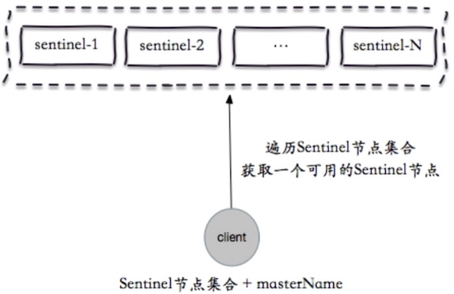  
（2）step2  
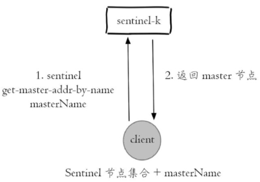   
（3）step3  
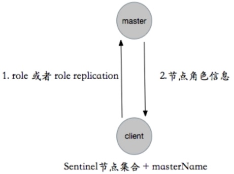  
（4）step4  
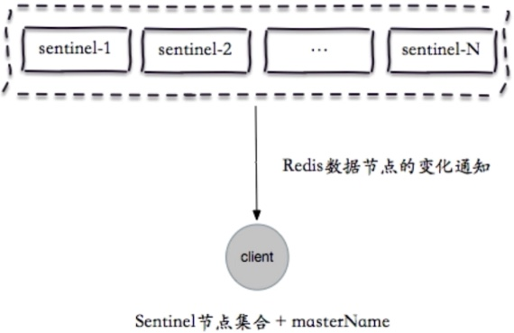  
- 客户端接入流程  
（1）sentinel地址集合；  
（2）masterName；  
（3）不是代理模式  
- jedis  

#### 5.实现原理  
- 故障转移演练  
（1）客户端高可用观察  
（2）服务端日志分析：数据节点和sentinel节点  
- 三个定时任务  
（1）每10秒每个sentinel对master和slave执行info：  
发现slave节点；确认主从关系；  
（2）每2秒每个sentinel通过master节点的channel交换信息（pub/sub）：  
通过__sentinel__:hello频道交互；交互对节点的“看法”和自身信息  
（3）每1秒每个sentinel对其它sentinel和redis执行ping：  
失败检测；失败判定依据  
- 主观下线和客观下线  
```
sentinel monitor <masterName> <ip> <port> <quorum>
eg: sentinel monitor mymaster 127.0.0.1 6379 2
sentinel down-after-milliseconds <masterName> <timeout>
eg: sentinel down-after-milliseconds mymaster 30000
```
（1）主观下线：每个sentinel节点对Redis节点失败的“偏见”  
（2）客观下线：所有sentinel节点对Redis节点失败“达成共识”（超过quorum个统一）  
sentinel is-master-down-by-addr  
- 领导者选举  
（1）原因：只有一个sentinel节点完成故障转移  
（2）领导者选举  
每个做主观下线的sentinel节点向其它sentinel节点发送命令，要求将它设置为领导者；
收到命令的sentinel节点如果没有同意通过其它sentinel节点发送的命令，那么将同意该请求，否则拒绝；
如果该sentinel节点发现自己的票数已经超过sentinel集合半数且超过quorum，那么它将成为领导者；
如果此过程有多个sentinel节点成为了领导者，那么将等待一段时间重新进行选举。  
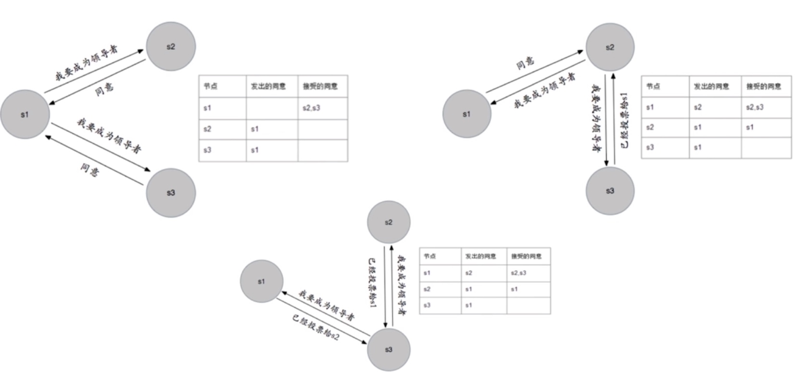  
- 故障转移  
（1）从slave节点中选出一个“合适的”节点作为新的master节点；  
（2）对上面的slave节点执行slaveof no one命令让其成为master节点；  
（3）向剩余的slave节点发送命令，让它们成为新master节点的slave节点，复制规则和parallel-syncs参数有关  
（4）更新对原来master节点配置为slave，并保持着对其“关注”，当其回复后命令它去复制新的master节点。  
- 选择“合适的”slave节点  
（1）选择slave-priority（slave节点优先级）最高的slave节点，如果存在则返回，不存在则继续；  
（2）选择复制偏移量最大的slave节点（复制的最完整），如果存在则返回，不存在则继续；  
（3）选择runId最小的slave节点  

#### 6.常见开发运维问题  
- 节点运维（节点上线和下线）  
节点下线原因：  
（1）机器下线：例如过保等情况；  
（2）机器性能不足：例如CPU、内存、硬盘、网络等  
（3）节点自身故障：例如服务不稳定等  

节点下线：  
（1）主节点  
``` sentinel failover <masterName> ```  
  
（2）从节点  
临时下线还是永久下线，例如是否做一些清理工作，但是要考虑读写分离的情况。  
（3）sentinel节点，同从节点  

节点上线：  
（1）主节点  
sentinel failover进行替换  
（2）从节点  
slavof即可，sentinel节点可以感知  
（3）sentinel节点：参考其它sentinel节点启动即可  

- 高可用读写分离  
（1）JedisSentinelPool源码分析  
（2）从节点作用  
副本：高可用的基础；扩展：读能力  
（3）三个"消息"  
swich-master：切换主节点（从节点晋升主节点）  
convert-to-slave：切换从节点（原主节点降为从节点）  
sdown：主观下线  
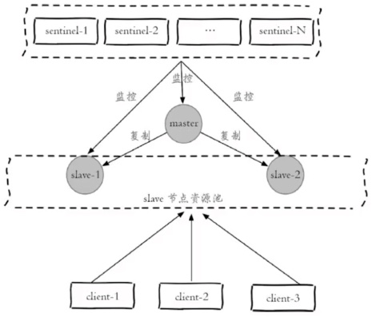  

#### 7.小结  
- Redis Sentinel是Redis的高可用实现方案：故障发现、故障自动转移、配置中心、客户端通知；  
- Redis Sentinel从Redis2.8版本才开始正式生产使用，之前版本生产不可用；  
- 尽可能在不同物理机上部署Redis Sentinel所有节点；  
- Redis Sentinel中的Sentinel节点个数应该为大于等于3且最好为奇数；  
- Redis Sentinel中的数据节点与普通数据节点没有区别；  
- 客户端初始化时连接的是Sentinel节点集合，不再是具体的Redis节点，但Sentinel只是配置中心不是代理；  
- Redis Sentinel通过三个定时任务实现了Sentinel节点对于主节点、从节点、其余Sentinel节点的监控；  
- Redis Sentinel在对节点做失败判定时分为主观下线和客观下线；  
- 看懂Redis Sentinel故障转移日志对于Redis Sentinel以及问题排查非常有帮助；  
- Redis Sentinel实现读写分离高可用可以依赖Sentinel节点的消息通知，获取Redis数据节点的状态变化  

### 八、Redis Cluster  
#### 1.呼唤集群  
- 为什么呼唤  
（1）并发量  
（2）数据量  
（3）网络流量  
- 解决方法  
（1）配置“强悍”的机器：超大内存、性能好的CPU等；  
（2）正确的解决方法：分布式（简单的认为加机器）  
- 集群：规模化需求  
（1）并发量：OPS；  
（2）数据量：“大数据”  
（3）Redis Cluster is release in 3.0  

#### 2.数据分布  
- 数据分布对比  

|分布方式|特点|典型产品|
|:----|:----|:----|
|哈希发布|数据分散度高<br>键值分布业务无关<br>无法顺序访问<br>支持批量操作|一致性哈希Memcache<br>Redis Cluster<br>其它缓存产品|
|顺序分布|数据分散度易倾斜<br>键值业务相关<br>可顺序访问<br>支持批量操作|BigTable<br>HBase|

- 哈希分布  
（1）节点取余分布：hash(key)%nodes  
（扩容时，迁移率80%，建议使用翻倍扩容方式，此时迁移率50%）  
客户端分片：哈希 + 取余  
节点伸缩：数据节点关系变化，导致数据迁移  
迁移数量和添加节点数量有关，建议翻倍扩容  
（2）一致性哈希分布  
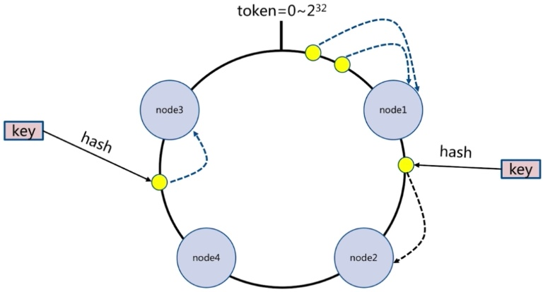  
客户端分片：哈希 + 顺时针（优化取余）  
节点伸缩：只影响邻近接待你，但是还是又数据迁移  
翻倍伸缩：保证最小迁移数据和负载均衡  

（3）虚拟槽分布  
预设虚拟槽：每个槽映射一个数据子集，一般比节点数大  
良好的哈希函数：例如CRC16  
服务端管理节点、槽、数据：例如Redis Cluster  
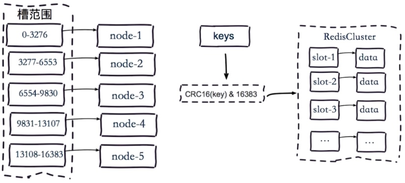  

#### 3.搭建集群  
- 分布式架构  
  
- Redis Cluster架构  
（1）节点  
cluster-enabled:yes  
（2）meet  
所有节点共享消息  
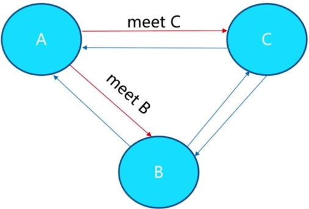  
（3）指派槽  
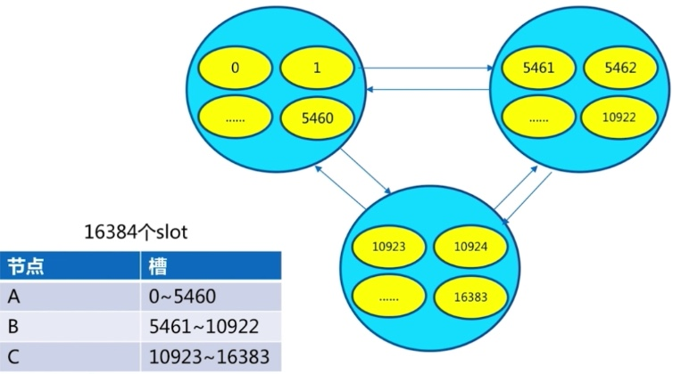  
客户端client：keyhash = hash(key)；slot = keyhash % 16383  
（4）复制  
复制；高可用；分片  
- 原生安装（理解Redis Cluster架构，生产环境不会使用）  
（1）原生命令安装  
步骤：配置开启节点；meet；指派槽；主从  
cluster节点的主要配置：  
```
cluster-enabled yes
cluster-node-timeout 15000
cluster-config-file "nodes.conf"
# yes代表集群中所有节点可用，集群才对外提供服务，一般配置成no
cluster-require-full-coverage yes
```
原生集群安装过程（三主三从）：  
172.16.49.131 8000（主）  
172.16.49.131 8001（主）  
172.16.49.131 8002（主）  
172.16.49.131 8003（从）  
172.16.49.131 8004（从）  
172.16.49.131 8005（从）  
```
配置准备节点：
bind 0.0.0.0
port 8000
daemonize yes
pidfile /var/run/redis-8000.pid
dir /opt/app/redis/data/
logfile "8000.log"
dbfilename dump-8000.rdb
cluster-enabled yes
cluster-config-file nodes-8000.conf
cluster-require-full-coverage no

sed 's/8000/8001/g' redis-8000.conf > redis-8001.conf
sed 's/8000/8002/g' redis-8000.conf > redis-8002.conf
sed 's/8000/8003/g' redis-8000.conf > redis-8003.conf
sed 's/8000/8004/g' redis-8000.conf > redis-8004.conf
sed 's/8000/8005/g' redis-8000.conf > redis-8005.conf

开启节点：
redis-server redis-8000.conf
redis-server redis-8001.conf
redis-server redis-8002.conf
redis-server redis-8003.conf
redis-server redis-8004.conf
redis-server redis-8005.conf

redis-cli -h 172.16.49.131 -p 8000 cluster nodes
redis-cli -h 172.16.49.131 -p 8000 cluster info

开放端口：
firewall-cmd --permanent --zone=public --add-port=8000/tcp
firewall-cmd --permanent --zone=public --add-port=8001/tcp
firewall-cmd --permanent --zone=public --add-port=8002/tcp
firewall-cmd --permanent --zone=public --add-port=8003/tcp
firewall-cmd --permanent --zone=public --add-port=8004/tcp
firewall-cmd --permanent --zone=public --add-port=8005/tcp
firewall-cmd --reload

meet：cluster meet ip port
redis-cli -h 172.16.49.131 -p 8000 cluster meet 172.16.49.131 8001
redis-cli -h 172.16.49.131 -p 8000 cluster meet 172.16.49.131 8002
redis-cli -h 172.16.49.131 -p 8000 cluster meet 172.16.49.131 8003
redis-cli -h 172.16.49.131 -p 8000 cluster meet 172.16.49.131 8004
redis-cli -h 172.16.49.131 -p 8000 cluster meet 172.16.49.131 8005

分配槽：cluster addslots slot [slot...]
redis-cli -h 172.16.49.131 -p 8000 cluster addslots {0...5460}
redis-cli -h 172.16.49.131 -p 8001 cluster addslots {5461...10922}
redis-cli -h 172.16.49.131 -p 8002 cluster addslots {10923...16383}

mkdir -p /opt/script
cd /opt/script
vim addslots.sh
添加脚本：
start=$1
end=$2
port=$3
for slot in `seq ${start} ${end}`
do
  echo "slot:${slot}"
  redis-cli -h 172.16.49.131 -p ${port} cluster addslots ${slot}
done

redis-cli -h 172.16.49.131 -p 8000 cluster nodes
sh addslots.sh 0 5460 8000
sh addslots.sh 5461 10922 8001
sh addslots.sh 10923 16383 8002

redis-cli -h 172.16.49.131 -p 8000 cluster slots

设置主从：cluster replicate node-id
redis-cli -h 172.16.49.131 -p 8003 cluster replicate 2b892e1f6be2f604b93ed55e1b673469d0132fda # ${node-id-8000}
redis-cli -h 172.16.49.131 -p 8004 cluster replicate df65a353d67d76667d319aea53de380bdfeca721 # ${node-id-8001}
redis-cli -h 172.16.49.131 -p 8005 cluster replicate 53378d0d6f8bfc4f397a329b323170ef49164b3d # ${node-id-8002}

redis-cli -h 172.16.49.131 -c -p 8000
```
- 官方工具安装  
（1）Ruby环境准备  
```
cd /opt/download
wget https://cache.ruby-lang.org/pub/ruby/2.6/ruby-2.6.5.tar.gz
tar -xvf ruby-2.6.5.tar.gz -C /opt/app
cd /opt/app/ruby-2.6.5
./configure -prefix=/usr/local/ruby
make && make install

/usr/local/ruby/bin/ruby --version
/usr/local/ruby/bin/gem --version
建立软链：
ln -s /usr/local/ruby/bin/ruby /usr/bin/ruby
ln -s /usr/local/ruby/bin/gem /usr/local/bin/gem
ruby -v
gem -v

cd /opt/download/ruby
wget http://rubygems.org/downloads/redis-3.3.5.gem
gem install -l redis-3.3.5.gem
或者直接执行：gem install redis -v 3.3.5

## 错误一：
ERROR:  Loading command: install (LoadError)
        cannot load such file -- zlib
ERROR:  While executing gem ... (NoMethodError)
    undefined method `invoke_with_build_args' for nil:NilClass
## 解放方案：
yum -y install zlib zlib-devel

cd /opt/app/ruby-2.6.5/ext/zlib/
ruby extconf.rb
sed -i s#\$\(top_srcdir\)#../..# Makefile
make
make install

## 错误二：
Unable to require openssl, install OpenSSL and rebuild Ruby (preferred) or use non-HTTPS sources (Gem::Exception)
yum -y install openssl openssl-devel

cd /opt/app/ruby-2.6.5/ext/openssl/
ruby extconf.rb
sed -i 's#\$(top_srcdir)#../..#g' Makefile
make
make install
```
（2）配置开启Redis  
redis-server redis-8000.conf  
redis-server redis-8001.conf  
redis-server redis-8002.conf  
redis-server redis-8003.conf  
redis-server redis-8004.conf  
redis-server redis-8005.conf  

一键开启：  
./redis-trib.rb create --replicas 1 172.16.49.131:8000 172.16.49.131:8001 \
172.16.49.131:8002 172.16.49.131:8003 172.16.49.131:8004 172.16.49.131:8005  

```
# 关闭原生安装启动的cluster：
ps -ef | grep redis-server | grep 700 | awk '{print $2}'
ps -ef | grep redis-server | grep 700 | awk '{print $2}' | xargs kill
cd /opt/app/redis/data
rm -rf *

编写启动、关闭脚本：
cd /opt/script
vim start-redis-cluster.sh
for((i=0;i<6;i++));
do 
  redis-server /opt/app/redis/config/redis-800$i.conf;
done

vim stop-redis-cluster.sh
for((i=0;i<6;i++));
do
  redis-cli -h 172.16.49.131 -c -p 800$i shutdown;
done

cd /opt/app/redis/src
./redis-trib.rb create --replicas 1 172.16.49.131:8000 172.16.49.131:8001 172.16.49.131:8002 172.16.49.131:8003 172.16.49.131:8004 172.16.49.131:8005

redis-cli -h 172.16.49.131 -c -p 8000
cluster nodes
cluster info
```

- 安装小结  
（1）原生命令安装  
理解Redis Cluster架构；生产环境不使用  
（2）官方工具安装  
高效、准确；生产环境可以使用  
（3）其它：可视化部署  

#### 4.集群伸缩  
- 伸缩原理  

- 扩容集群  
（1）准备新节点  
集群模式；配置和其它节点统一；启动后是孤儿节点  
redis-server conf/redis-6385.conf  
redis-server conf/redis-6386.conf  
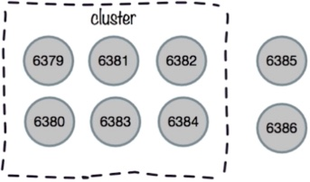  
（2）加入集群  
172.16.49.131:6379> cluster meet 172.16.49.131 6385  
172.16.49.131:6379> cluster meet 172.16.49.131 6386  
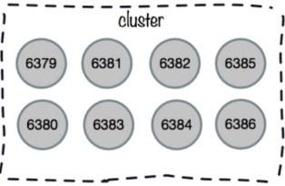  
任意节点观察集群配置：  
172.16.49.131:6379> cluster nodes  
作用：为它迁移槽和数据实现扩容；作为从节点负责故障转移  

官方工具（推荐）：  
redis-trib.rb add-node new_host:new_port existing_host:existing_port --slave --master-id <arg>
eg：redis-trib.rb add-node 172.16.49.131:6385 172.16.49.131:6379  
建议使用redis-trib.rb，能够避免新节点已经加入了其它集群造成故障  
（3）迁移槽和数据  
槽迁移计划：  
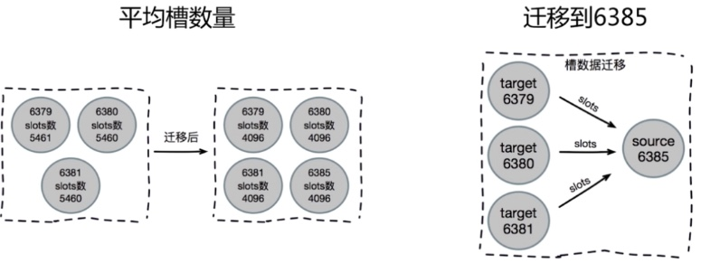  
迁移数据：  
a.对目标节点发送：cluster setslot {slot} importing {sourceNodeId}命令，让目标节点准备导入槽的数据；  
b.对源节点发送：cluster setslot {slot} migrating {targetNodeId}命令，让源节点准备迁出槽的数据；  
c.源节点循环执行：cluster getkeysinslot {slot} {count} 命令，每次获取count个属于槽的键；  
d.重复执行步骤c、d直到槽下所有的键数据迁移到目标节点；  
e.向集群内所有主节点发送cluster setslot {slot} node {targetNodeId}命令，通知槽分配给目标节点。  
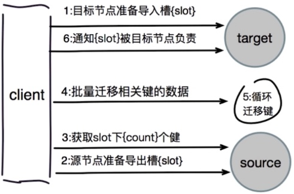  
对目标节点发送  
添加从节点  

扩容实验：  
```
# 配置准备新节点
cd /opt/app/redis/conf
sed 's/8000/8006/g' redis-8000.conf > redis-8006.conf
sed 's/8000/8007/g' redis-8000.conf > redis-8007.conf
redis-server redis-8006.conf
redis-server redis-8007.conf
redis-cli -h 172.16.49.131 -p 8006 cluster nodes

# 新节点加入集群，并指定新节点主从关系
redis-cli -h 172.16.49.131 -p 8000 cluster meet 172.16.49.131 8006
redis-cli -h 172.16.49.131 -p 8000 cluster meet 172.16.49.131 8007
redis-cli -h 172.16.49.131 -p 8000 cluster nodes
redis-cli -h 172.16.49.131 -p 8007 cluster replicate eea60f69c40d5502a7dddba96d7a0f67b1ca9e2d # ${node-id-8006}
redis-cli -h 172.16.49.131 -p 8000 cluster nodes

# 分配槽
cd ../src
./redis-trib.rb reshard 172.16.49.131:8000
4096
eea60f69c40d5502a7dddba96d7a0f67b1ca9e2d # ${node-id-8006}
all
yes

redis-cli -p 8000 cluster slots
redis-cli -p 8000 cluster nodes | grep master
```

- 缩容集群  
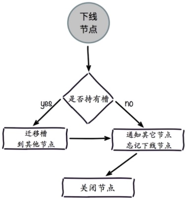  
（1）下线迁移槽  
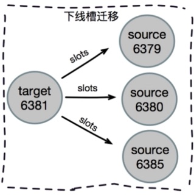  
（2）忘记节点  
redis-cli> cluster forget {downNodeid}  
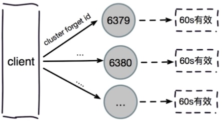  
（3）关闭节点  

缩容实验：  
```
ps -ef | grep redis-server | grep 800
redis-cli -h 172.16.49.131 -p 8000 cluster nodes
cd /opt/app/redis/src

# 下线迁移槽数据
# ./redis-trib.rb reshard --from ${node-id-8006} --to ${node-id-8000} --slots 1365 172.16.49.131:8006
./redis-trib.rb reshard --from eea60f69c40d5502a7dddba96d7a0f67b1ca9e2d --to c3cf62427fa8a81374e436e8656070f1cfee9e10 --slots 1365 172.16.49.131:8006
yes
redis-cli -h 172.16.49.131 -p 8000 cluster nodes
# ./redis-trib.rb reshard --from ${node-id-8006} --to ${node-id-8001} --slots 1366 172.16.49.131:8006
./redis-trib.rb reshard --from eea60f69c40d5502a7dddba96d7a0f67b1ca9e2d --to abfbe2f8802ee7dfa3a107cd8ab53d8247685ccb --slots 1366 172.16.49.131:8006
yes
redis-cli -h 172.16.49.131 -p 8000 cluster nodes
# ./redis-trib.rb reshard --from ${node-id-8006} --to ${node-id-8002} --slots 1366 172.16.49.131:8006
./redis-trib.rb reshard --from eea60f69c40d5502a7dddba96d7a0f67b1ca9e2d --to 5559c92d1bd8e2f7f2d39f183afc6fdee0795778 --slots 1366 172.16.49.131:8006
yes

# 忘记节点（先下线从节点，再下线主节点）
redis-cli -h 172.16.49.131 -p 8000 cluster nodes
# ./redis-trib.rb del-node 172.16.49.131:8000 9b264cc899cd3d1e370ca52e894e4667cdc927ce # ${node-id-8007}
redis-cli -h 172.16.49.131 -p 8000 cluster nodes
# ./redis-trib.rb del-node 172.16.49.131:8000 eea60f69c40d5502a7dddba96d7a0f67b1ca9e2d # ${node-id-8006}
redis-cli -h 172.16.49.131 -p 8000 cluster nodes
```

#### 5.客户端路由  
- moved重定向  
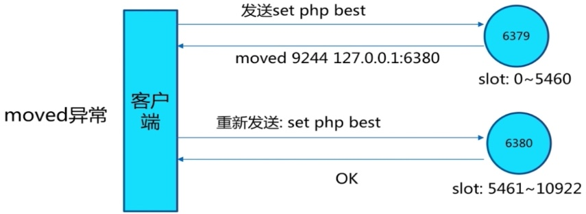  
cluster keyslot key：计算key所在槽  
```
redis-cli -h 172.16.49.131 -p 8000
cluster keyslot hello
cluster slots
# (error) MOVED 9244 172.16.49.131:8001
set php best
cluster keyslot php
exit
redis-cli -h 172.16.49.131 -c -p 8000
# Redirected to slot [9244] located at 172.16.49.131:8001
# OK
set php best
get php
```
- ask重定向  
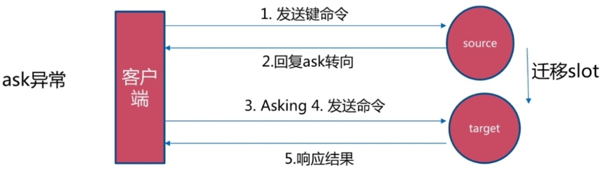  

- moved和ask比对  
（1）两者都是客户端重定向  
（2）moved：槽已经确定迁移  
（3）ask：槽不在迁移中  

- smart客户端  
（1）smart客户端原理：追求性能  
a.从集群中选一个可运行节点，使用cluster slots初始化槽和节点映射；  
b.将cluster slots的结果映射到本地，为每个节点创建JedisPool；  
c.准备执行命令  
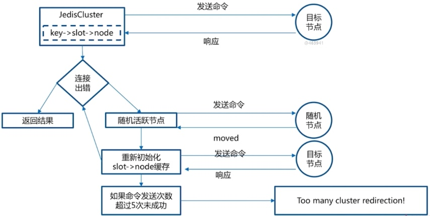  
（2）smart客户端使用：JedisCluster  
a.JedisCluster基本使用；  
单例：内置了所有节点的连接池；无需手动借还连接池；合理设置commons-pool  
b.整合Spring；  
c.多节点命令实现；  
d.批量命令实现  

|方案|优点|缺点|网络IO|
|:----|:----|:----|:----|
|串行mget|编程简单<br>少量keys满足需求|大量keys请求延迟严重|O(keys)|
|串行IO|编程简单<br>少量节点满足需求|大量node延迟严重|O(nodes)|
|并行IO|利用并行特性<br>延迟取决于最慢的节点|编程复杂<br>超时定位问题难|O(max_slow(node))|
|hash_tag|性能最高|读写增加tag维护成本<br>tag分布易出现数据倾斜|O(1)|

#### 6.集群原理  
- 故障转移  
（1）故障发现  
a.通过ping/pong消息实现故障发现：不需要sentinel  
b.主观下线：某个节点认为另一个节点不可用，“偏见”  
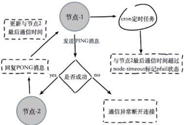  
客观下线：当半数以上持有槽的主节点都标记某节点主观下线  
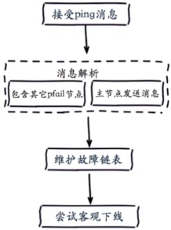  
（2）故障恢复  
a.资格检查  
每个从节点检查与故障主节点的断线时间；  
超过cluster-node-timeout * cluster-slave-validity-factor取消资格；  
cluster-slave-validity-factor：默认是10  
b.准备选举时间  
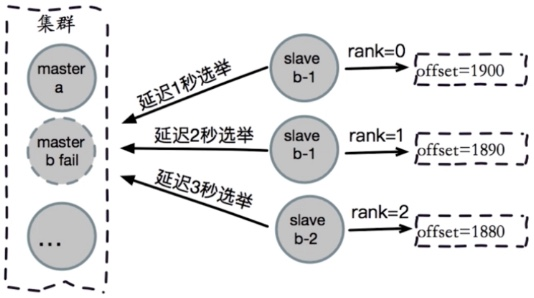  
c.选举投票  
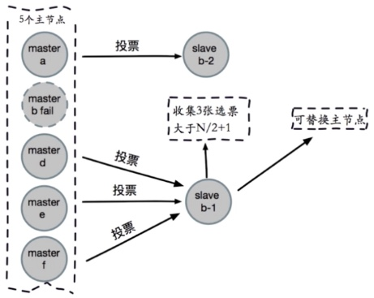  
d.替换主节点  
当前从节点取消复制变为主节点（slaveof no one）；  
执行clusterDelSlot撤销故障主节点负责的槽，并执行clusterAddSlot把这些槽分配给自己；  
向集群广播自己的pong消息，表明已经替换了故障从节点  
（3）故障转移演练  
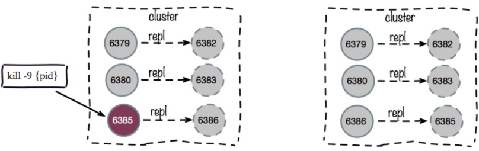  
模拟步骤：  
a.执行kill -9 节点模拟宕机；  
b.观察客户端故障恢复时间；  
c.观察各个节点的日志  
```
cd /opt/app/redis/src
./redis-trib.rb info 172.16.49.131:8000
redis-cli -h 172.16.49.131 -p 8000 info server
redis-cli -h 172.16.49.131 -p 8000 info server | grep process_id
kill -9 pid
客户端：代码failOver单元测试
redis-cli -h 172.16.49.131 -p 8003 info server
redis-cli -h 172.16.49.131 -p 8005 cluster slots
redis-server redis-7000.conf 
```
#### 7.开发运维常见问题  
- 集群完整性  
cluster-require-full-coverage，默认为yes  
集群中16384个槽全部可用：保证集群完整性；  
节点故障或者正在故障转移：(error) CLUSTERDOWN Ther cluster is down；  
大多数业务无法容忍，cluster-require-full-coverage建议设置为no  
- 带宽消耗  
  
（1）官方建议：不超过1000个；  
（2）ping/pong消息；  
（3）不容忽视的带宽消耗  
消息发送频率：节点发现与其它节点最后通信时间超过cluster-node-timeout/2时会直接发送ping消息；  
消息数据量：slots槽数组（2KB空间）和整个集群1/10的状态数据（10个节点状态数据约1KB）  
节点部署的机器规模：集群分布的机器越多且每台机器划分的节点数越均匀，则集群内整体的可用带宽越高；  
eg：  
规模：节点200个、20台物理机（每台10个节点）  
cluster-node-timeout = 15000，ping/pong带宽为25Mb  
cluster-node-timeout = 20000，ping/pong带宽低于15Mb  
优化：  
避免“大”集群：避免多业务使用一个集群，大业务可以多集群；  
cluster-node-timeout：带宽和故障转移速度的均衡  
尽量均匀分配到多机器上：保证高可用和带宽  
- Pub/Sub广播  
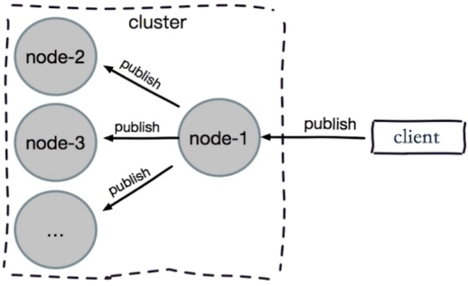  
（1）问题：publish在集群每个节点广播：加重带宽；  
（2）解决：单独“走”一套Redis Sentinel  
- 数据倾斜：内存不均  
原因：  
（1）节点和槽分配不均；  
redis-trib.rb info ip:port查看节点、槽、键值分布  
redis-trib.rb rebalance ip:port进行均衡（谨慎使用）  
（2）不同槽对应键值数量差异较大；  
CRC16正常情况下比较均匀；  
可能存在hash_tag；  
cluster countkeysinslot {slot}：获取槽对应键值个数  
（3）包含bigkey：例如大字符串、几百万的元素的hash、set等  
从节点执行：redis-cli --bigkeys  
优化：优化数据结构  
（4）内存相关配置不一致  
hash-max-ziplist-value、set-max-intset-entries等  
优化：定期“检查”配置一致性；  
- 请求倾斜  
（1）热点key：重要的key或者bigkey  
（2）优化：  
避免bigkey；  
热键不要用hash_tag；  
当一致性不高时，可用本地缓存 + MQ  
- 读写分离  
（1）只读连接：集群模式的从节点不接受任何读写请求  
a.重定向到负责槽的主节点；  
b.readonly命令可以读：连接级别命令  
（2）读写分离：更加复杂  
a.同样的问题：复制延迟、读取过期数据、从节点故障  
b.修改客户端：cluster slaves {nodeId}  

- 数据迁移  
（1）官方迁移工具：redis-trib.rb import  
a.只能从单机迁移到集群；  
b.不支持在线迁移：source需要停写；  
c.不支持断点续传；  
d.单线程迁移：影响速度  
（2）在线迁移  
a.唯品会：redis-migrate-tool  
b.豌豆荚：redis-port  
```
cd /opt/app/redis/src
./redis-trib.rb import --from 172.16.49.131:6388 --copy 172.16.49.131:8000
```
- 集群vs单机  
（1）集群限制  
a.key批量操作支持有限：例如mget、mset必须在一个slot；  
b.key事务和lua支持有限：操作的key必须在一个节点；  
c.key是数据分区的最小粒度：不支持bigkey分区；  
d.不支持多个数据库：集群模式下只有一个db 0；  
e.复制只支持一层：不支持树形复制结构  
（2）思考-分布式Redis不一定好  
a.Redis Cluster：满足容量和性能的扩展性，很多业务“不需要”；  
大多数时客户端性能会“降低”；  
命令无法跨节点使用：mget、mset、scan、flush、sinter等；  
Lua和事务无法跨节点使用；  
客户端维护更复杂：SDK和应用本身消耗（例如更多的连接池）  
b.很多场景Redis Sentinel已经足够好  

- 集群总结  
（1）Redis Cluster数据分区规则采用虚拟槽方式（16384个槽），每个节点负责一部分槽和相关数据，实现数据和请求的负载均衡；  
（2）搭建集群划分四个步骤：准备节点、节点握手、分配槽、复制，redis-trib.rb工具用于快速搭建集群；  
（3）集群伸缩通过在节点之间移动槽和相关数据实现：  
a.扩容时更具槽迁移计划把槽从源节点迁移到新节点；  
b.收缩时如果下线的节点有负责的槽需要迁移到其它节点，再通过cluster forget命令让集群内所有节点忘记被下线的节点。  
（4）使用smart客户端操作集群达到通信效率最大化，客户端内部负责计算维护键->槽->节点的映射，用于快速定位到目标节点；  
（5）集群自动故障转移过程分为故障发现和节点恢复。节点下线分为主观下线和客观下线，当超过半数主节点认为故障节点为主观下线时标记它为客观下线状态。从节点负责对客观下线的主节点触发故障恢复流程，保证集群可用性。  
（6）可发运维常见问题包括：超大规模集群带宽消耗，pub/sub广播问题，集群倾斜问题，单机和集群对比等  

### 九、缓存设计与优化  
#### 1.缓存的收益与成本  
- 收益  
（1）加速读写
通过缓存加速读写嘟嘟：CPU L1/L2/L3 Cache、Linux page Cache加速硬盘读写、浏览器缓存、Ehcache缓存数据库结果；  
（2）降低后端负载  
后端服务器通过前端缓存降低负载：业务端使用Redis降低后端MySQL负载等  
- 成本  
（1）数据不一致：缓存层和数据层有时间窗口不一致，和更新策略有关；  
（2）代码维护成本：多了一层缓存逻辑；  
（3）运维成本：例如Redis Cluster  
- 使用场景  
（1）降低后端负载  
对高消耗的SQL：join结果集/分组统计结果缓存；  
（2）加速请求响应  
利用Redis/Memcache优化IO响应时间；  
（3）大量写合并批量写：  
如计数器先Redis累加再批量写DB  

#### 2.缓存更新策略  
（1）LRU/LFU/FIFO算法剔除：例如maxmemory-policy；  
（2）超时剔除：例如expire；  
（3）主动更新：开发控制生命周期；  

|策略|一致性|维护成本|
|:----|:----|:----|
|LRU/LIRS算法剔除|最差|低|
|超时剔除|较差|低|
|主动更新|强|高|

（4）建议：  
a.低一致性：最大内存和淘汰策略；  
b.高一致性：超时剔除和主动更新结合，最大内存和淘汰策略兜底  

#### 3.缓存粒度控制  
  
（1）通用性：全量属性更好；  
（2）占用空间：部分属性更好；  
（3）代码维护：表面上全量属性更好；  

#### 4.缓存穿透优化
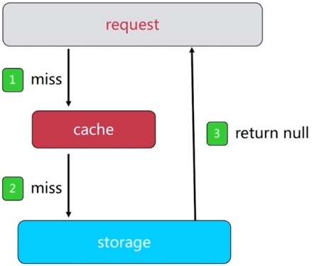  
- 原因  
（1）业务代码自身问题；  
（2）恶意攻击、爬虫等；  
- 如何发现  
（1）业务的响应时间；  
（2）业务本身问题；  
（3）相关指标：总调用数、缓存层命中数、存储层命中数  
- 解决方法1-缓存空对象
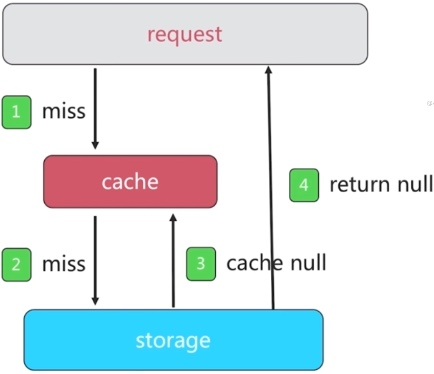  
问题：  
a.需要更多的键（设置过期时间）；  
b.缓存层和存储层数据“短期”不一致（业务恢复正常，订阅刷新缓存）；  
伪代码示例：  
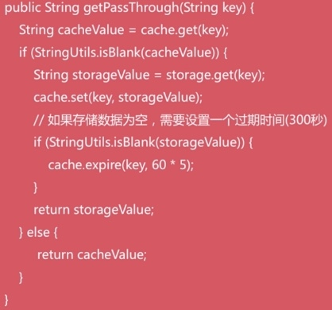  
- 解决方法2-布隆过滤器拦截  
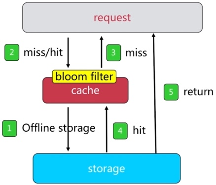    
使用场景：缓存数据相对固定，或者有办法定期更新缓存；  

#### 5.无底洞问题优化  
- 问题描述  
（1）2010年，Facebook有了3000个Memcache节点；  
（2）发现问题：“加”机器性能没有提升，反而下降；  
- 问题关键点  
（1）更多的机器 != 更高的性能；  
（2）批量接口需求（mget,mset等）；  
（3）数据增长与水平扩展需求  
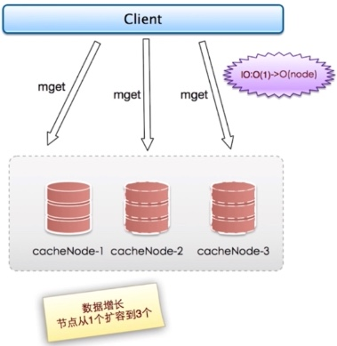  

- 优化IO的方法  
（1）命令本身优化：例如慢查询keys、hgetall、bigkey  
（2）减少网络通信次数；  
（3）降低接入成本：例如客户端长连接／连接池、NIO等  

#### 6.缓存雪崩优化  

#### 7.热点key重建优化  
- 问题描述：热点key + 较长的重建时间  
- 三个目标  
（1）减少重建缓存的次数；  
（2）数据尽可能一致；  
（3）减少潜在危险  
- 两个解决办法  
（1）互斥锁（mutex key）  
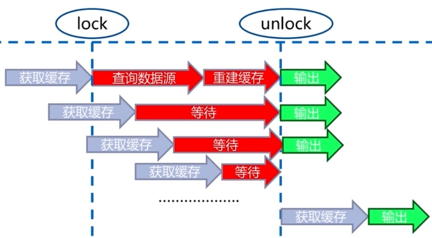  
伪代码：  
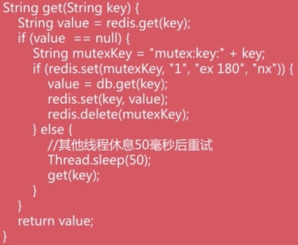  
（2）永远不过期  
a.缓存层面：没有设置过期时间（没有用expire）;  
b.功能层面：为每个value添加逻辑过期时间，但发现超过逻辑过期时间后，会使用单独的线程去构建缓存；  
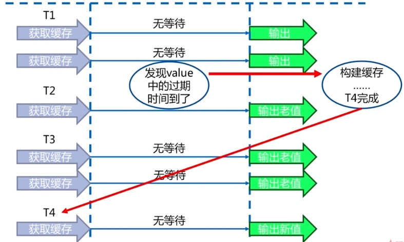  
伪代码：  
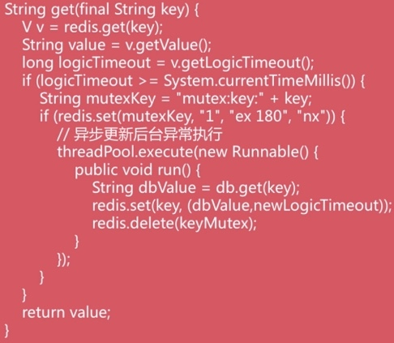  

|方案|优点|缺点|
|:----|:----|:----|
|互斥锁|思路简单<br>保证一致性|代码复杂度增加<br>存在死锁的风险|  
|永远不过期|基本杜绝热点key重建问题|不保证一致性<br>逻辑过期时间增加维护成本和内存成本|  

#### 8.总结  
- 缓存收益：加入读写、降低后端存储负载  
- 缓存成本：缓存和存储数据不一致性、代码维护成本、运维成本；  
- 推荐结合剔除、超时、主动更新三种方案共同完成；  
- 穿透问题：使用缓存空对象和布隆过滤器来解决，注意她们各自的使用场景和局限性；  
- 无底洞问题：分布式缓存中，有更多的机器不保证有更高的性能。有四种批量操作方式：串行命令、串行IO、并行IO、hash_tag  
- 雪崩问题：缓存层高可用、客户端降级、提前演练是解决雪崩问题的重要方法  
- 热点key问题：互斥锁、“永不过期”能够再一定成都伤解决热点key问题，开发人员在使用时要了解它们各自的使用成本  

### 十、[Redis云平台CacheCloud](https://github.com/sohutv/cachecloud)  
#### 1.Redis规模化运维  
- 遇到的问题  
（1）发布构建繁琐，私搭乱建；  
（2）节点&机器运维成本  
（3）监控报警初级  
- CacheCloud  
（1）一键开启Redis（Standalone、Sentinel、Cluster）；  
（2）机器、应用、实例监控和报警；  
（3）客户端：透明使用、性能上报；  
（4）可视化运维：配置、扩容、Failover、机器／应用／实例上下线；  
（5）已经存在的Redis直接接入和数据迁移  
- 使用规模  
（1）300+亿 commans/day  
（2）3TB Memory Total  
（3）1300+ Instances Total  
（4）200+ Machines Total  
- 使用场景  
（1）全量视频缓存（视频播放API）：跨机房高可用  
（2）消息队列同步（RedisMQ中间件）  
（3）分布式布隆过滤器  
（4）计数系统：计数（播放数）  
（5）其它：排行榜、社交（直播）、实时计算（反作弊）等  


